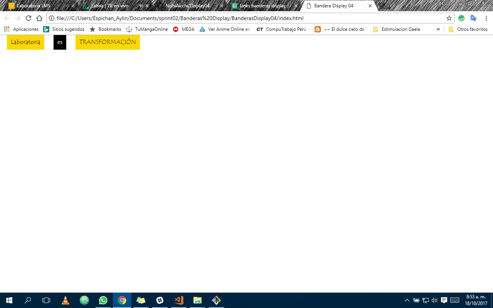

# *Banderas Display version 4*

Realizamos el ejercicio de Banderas replicando el cuarto ejercicio.

## Objetivos:
Entender y manejar el uso de **Display** para el *maquetado de paginas web* de manera óptima.

### Herramientas Utilizadas
1. HTML
2. CSS externo
3. Javascript

#### Imagen Previa

